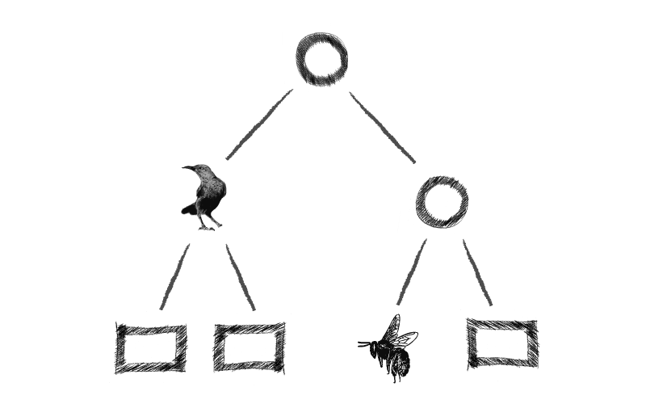

# The birds, the bees, and the merkle trees

A developer-focused educational series on blockchain technology.
The purpose of this series is to give a bottom-up view of how blockchians
work, by experimenting with and building core blockchain technologies.
This series is for educational purposes only and should not be construed
as adivce or reccommendations concerning best-practices for security,
cryptography, etc...
